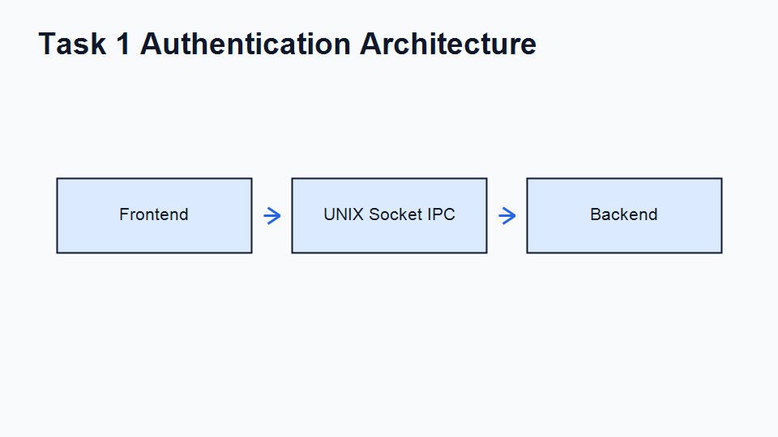
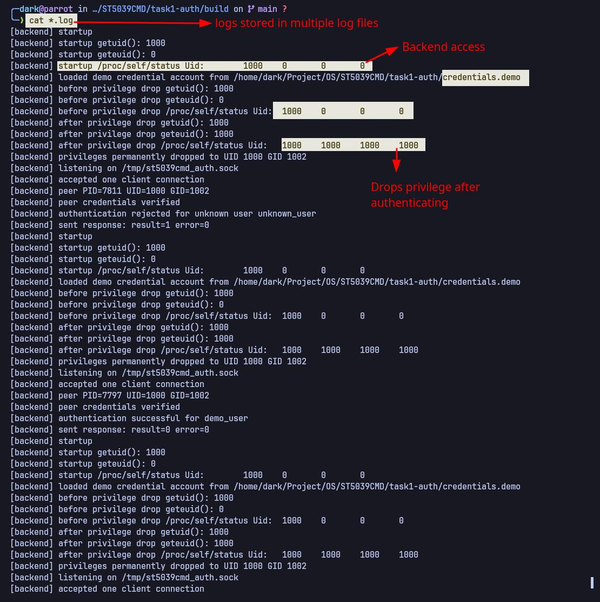
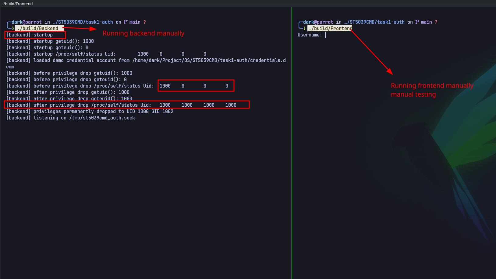
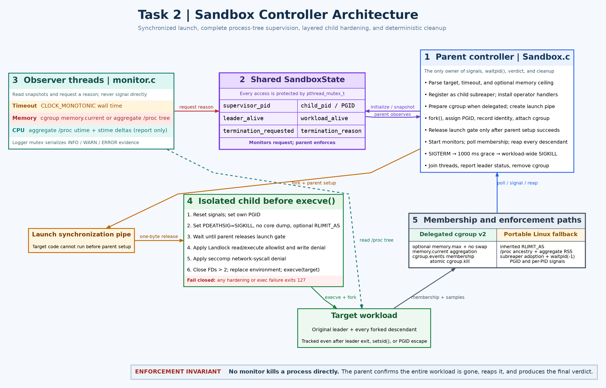

# ST5039CMD CW1: Authentication and Sandbox Controller

This repository contains both programs for ST5039CMD Programming and Operating
Systems coursework CW1:

| Task | Program | Purpose |
|---|---|---|
| 1 | `Frontend` and `Backend` | Demonstrate local IPC, peer identity checking, permanent privilege dropping, bounded input, and sensitive-memory cleanup. |
| 2 | `Sandbox` | Run and supervise a complete process tree with timeout, memory, CPU, filesystem, network, environment, descriptor, and cleanup controls. |

The programs target Linux. Run the assessed demonstrations in the coursework
Linux VM because they depend on Linux-specific kernel facilities and security
behavior.

## Quick Start

From the repository root:

```sh
make task1 task2
./task1-auth/run_task1.sh
./task2-sandbox/run_task2.sh
```

The first command builds both tasks and the Task 2 test programs. Each run
script rebuilds its own task if required, checks every expected result, and
returns `0` only when its complete demonstration passes.

## Requirements and Compatibility

Use the coursework Linux VM or a comparable Linux system with:

- GCC or another C11-compatible compiler;
- GNU Make and standard POSIX shell tools;
- POSIX threads and the Linux `/proc` filesystem;
- UNIX domain sockets, `SO_PEERCRED`, `setresuid()`, and `setresgid()`;
- Landlock and seccomp support; and
- preferably cgroup v2 delegation for the launching user.

Task 2 automatically falls back to `RLIMIT_AS`, `/proc` process-tree
accounting, process-group signalling, and per-process signalling when it cannot
create a delegated cgroup. Landlock and seccomp are mandatory: the target is
not started if either child-side security policy cannot be installed.

These programs are not intended to run natively on Windows or macOS. Some
containers also map user IDs differently from the coursework VM. In
particular, a container may make Task 1's deliberate root-regain check return
`EINVAL` instead of the normal `EPERM`; use the coursework VM for the final
privilege-drop demonstration.

To confirm the basic build tools are available:

```sh
gcc --version
make --version
uname -a
```

## Repository Layout

```text
ST5039CMD/
|-- README.md
|-- Makefile
|-- task1-auth/
|   |-- Frontend.c
|   |-- Backend.c
|   |-- auth_protocol.h
|   |-- secure_memory.c
|   |-- secure_memory.h
|   |-- credentials.demo
|   `-- run_task1.sh
|-- task2-sandbox/
|   |-- Sandbox.c
|   |-- monitor.c / monitor.h
|   |-- process_tree.c / process_tree.h
|   |-- security.c / security.h
|   |-- logger.c / logger.h
|   |-- run_task2.sh
|   `-- test/                 # focused target programs used by the test suite
`-- diagrams/
    |-- task1-architecture.png
    |-- task2-architecture.png
    `-- screenshots/          # captured build, automated, and manual evidence
```

Generated executables and logs are placed under `task1-auth/build/` and
`task2-sandbox/build/`. Both directories are ignored by Git.

## Building the Programs

Always run the following commands from the repository root, not from inside a
source or build directory.

```sh
make task1
make task2
```

The available Make targets are:

| Target | Result |
|---|---|
| `make task1` | Builds `task1-auth/build/Frontend` and `task1-auth/build/Backend`. |
| `make task2` | Builds `Sandbox`, all Task 2 test binaries, and checks that both run scripts are executable. |
| `make task2-tests` | Builds only the Task 2 target/test binaries. |
| `make task1-demo` | Builds Task 1 and runs its automated demonstration. |
| `make task2-demo` | Builds Task 2 and runs its automated demonstration. |
| `make evidence` | Prints where demonstration evidence is collected. |
| `make clean` | Removes both generated `build/` directories. |

For a clean rebuild:

```sh
make clean
make task1 task2
```

Successful compilation creates these main executables:

```text
task1-auth/build/Frontend
task1-auth/build/Backend
task2-sandbox/build/Sandbox
```

.png>)

## Task 1 User Guide: Privilege-Separated Authentication

### Architecture and Security Flow



The backend performs its security-sensitive setup in this order:

1. Record the invoking real UID and GID.
2. Resolve and load the single fake account from `credentials.demo`.
3. Permanently drop real, effective, and saved privileges to the invoking user.
4. Prove that effective UID `0` cannot be regained.
5. Create `/tmp/st5039cmd_auth.sock`, accept one frontend, and verify the
   kernel-reported peer PID, UID, and GID with `SO_PEERCRED`.
6. Validate the fixed-size, versioned `AuthRequest`, compare both credential
   fields, and send a structured `AuthResponse`.
7. Close descriptors, unlink the socket, and clear credential/request buffers.

The frontend bounds input to 64 username characters and 128 password
characters, hides password input on a terminal, rejects empty or oversized
values, and clears sensitive buffers before exiting.

The committed demonstration account is deliberately fake:

```text
Username: demo_user
Password: demo_password
```

Never place a real username or password in `task1-auth/credentials.demo`.

### Optional Set-User-ID Setup for the Full Privilege-Drop Demonstration

A normal build can test authentication and the permanent-drop checks, but it
does not begin with an elevated effective UID. To demonstrate the intended
root-to-user transition, build first and then configure only the backend in the
isolated coursework VM:

```sh
make task1
sudo chown root:root task1-auth/build/Backend
sudo chmod 4755 task1-auth/build/Backend
ls -l task1-auth/build/Backend
```

The `ls` output should show an `s` in the owner's execute position, such as
`-rwsr-xr-x`. Do not apply set-user-ID permission to `Frontend`, the scripts,
or any other file. Rebuilding `Backend` may clear the set-user-ID bit, so repeat
these ownership and permission commands after a rebuild when elevated evidence
is required.

### Task 1 Automated Testing

Run:

```sh
./task1-auth/run_task1.sh
```

If executable permissions were lost while copying or extracting the project,
restore them once with:

```sh
chmod +x task1-auth/run_task1.sh task2-sandbox/run_task2.sh
```

The script builds Task 1 and runs a new one-connection backend for each case:

| Automated case | Input | Expected frontend status | Expected result |
|---|---|---:|---|
| `valid-login` | `demo_user` / `demo_password` | `0` | `Authentication succeeded` |
| `wrong-password` | `demo_user` / `wrong_password` | `1` | Generic `invalid username or password` failure |
| `unknown-user` | `unknown_user` / `demo_password` | `1` | The same generic failure, so account existence is not disclosed |

The final line must be:

```text
Task 1 demonstration completed successfully.
```

The script also writes one backend log per case:

```sh
ls -l task1-auth/build/task1-*.log
cat task1-auth/build/task1-valid-login.log
cat task1-auth/build/task1-wrong-password.log
cat task1-auth/build/task1-unknown-user.log
```

The logs show UID state before and after the permanent drop, the socket path,
the peer PID/UID/GID check, the authentication decision, and the response code.
Passwords are never logged.




### Task 1 Manual Testing: Exact Two-Terminal Procedure

Manual testing requires two terminals. Both terminals must be logged in as the
same normal user and must refer to the same repository checkout.

#### 1. Build and prepare

In **Terminal A**, move to the repository root and build:

```sh
cd /path/to/ST5039CMD
make task1
```

If the assessment needs to show an elevated-to-unprivileged transition, apply
the optional set-user-ID setup above now. Otherwise continue with the normal
binary.

#### 2. Start the one-connection backend

Still in **Terminal A**, run:

```sh
./task1-auth/build/Backend
```

Do not type the frontend credentials into this terminal. Wait until the backend
prints:

```text
[backend] listening on /tmp/st5039cmd_auth.sock
```

Leave Terminal A running at that point. If the backend exits before printing
`listening`, read the troubleshooting section below before starting the
frontend.

#### 3. Connect with the frontend

In **Terminal B**, move to the same repository root and run:

```sh
cd /path/to/ST5039CMD
./task1-auth/build/Frontend
```

At `Username:`, type `demo_user` and press Enter. At `Password:`, type
`demo_password` and press Enter. Nothing should appear while the password is
typed; that is intentional terminal-echo protection.

Terminal B should report:

```text
Authentication succeeded: authentication successful (result=0, error=0)
```

Immediately display the frontend exit status:

```sh
printf 'Frontend exit status: %s\n' "$?"
```

It should be `0` for the valid login.

#### 4. Check the backend result

Return to **Terminal A**. It should show an accepted client, verified peer
credentials, a successful authentication decision, and `result=0 error=0`.
The backend then exits automatically because it intentionally serves exactly
one connection. It also removes `/tmp/st5039cmd_auth.sock`.

#### 5. Repeat the two negative cases

For every new login attempt, first restart this command in Terminal A and wait
for `listening` again:

```sh
./task1-auth/build/Backend
```

Then run `Frontend` again in Terminal B and enter each test pair:

| Manual case | Username | Password | Frontend status | What to verify |
|---|---|---|---:|---|
| Valid | `demo_user` | `demo_password` | `0` | Success message; backend logs `authentication successful`. |
| Wrong password | `demo_user` | `wrong_password` | `1` | Generic invalid-credentials message; backend logs rejection. |
| Unknown user | `unknown_user` | `demo_password` | `1` | The same generic frontend message; backend logs unknown-user rejection. |

Check `$?` immediately after each frontend run. Starting any other command
first replaces the status value.

#### 6. Optional input-validation checks

Restart the backend before each check. In the frontend, submitting an empty
username or password must be rejected. A username over 64 characters or a
password over 128 characters must also be rejected. These failures occur in
the frontend, so no authentication request is sent; stop the still-waiting
backend in Terminal A with `Ctrl+C` before starting the next case.




## Task 2 User Guide: Sandbox Controller

### Updated Architecture



The parent controller is the only component that sends workload signals,
reaps processes, decides the final status, and performs cleanup. The timeout,
memory, and CPU monitor threads only observe the workload and coordinate
through mutex-protected shared state.

Before the child can execute target code, the parent creates the optional
cgroup, forks, assigns the child to a process group, records its identity,
attaches it to the cgroup when available, and releases a synchronization pipe.
The child then installs:

- `PR_SET_PDEATHSIG=SIGKILL` and a no-core-dump resource limit;
- an inherited `RLIMIT_AS` memory ceiling when `--memory-kb` is supplied;
- a Landlock filesystem read/execute allowlist with host writes denied;
- a seccomp filter that denies network syscalls;
- a fixed minimal environment;
- closure of every descriptor above standard error; and
- `execve()` of the requested target.

The controller is a Linux child subreaper. It tracks the original leader and
all descendants, including a process that forks, calls `setsid()`, and lets its
original parent exit. Termination is workload-wide: `SIGTERM`, a 1000 ms grace
period, then `SIGKILL` if anything remains.

### Command-Line Reference

```text
Sandbox [--timeout SECONDS] [--memory-kb KILOBYTES] <target-binary> [args...]
```

| Argument | Meaning |
|---|---|
| `--timeout SECONDS` | Wall-clock timeout from 1 to 86400 seconds. Default: 5 seconds. |
| `--memory-kb KILOBYTES` | Memory ceiling from 1 to 4194304 kB. Memory enforcement is disabled when omitted. |
| `<target-binary>` | Executable path passed directly to `execve()`; use a built binary such as `./task2-sandbox/build/normal_exit`. |
| `[args...]` | Optional arguments passed unchanged to the target. |

CPU usage is always monitored and reported; there is no CPU-kill threshold.
Use `--` before the target only when option parsing must end explicitly.

The controller returns `0` only when the original leader exits with code `0`,
no sandbox policy requested termination, and no descendants remain. It returns
`1` for a timeout, memory-policy action, signal termination, child failure,
hardening failure, or supervisor/monitor error.

### Task 2 Automated Testing

Run the complete suite from the repository root:

```sh
./task2-sandbox/run_task2.sh
```

The script builds Task 2 and checks all twelve demonstrations:

| Automated case | What it proves | Status expected by the script |
|---|---|---:|
| `normal-exit` | A clean target is executed, reaped, and reported. | `0` |
| `timeout-kill` | A sleeping target is stopped at its wall-clock limit. | `1` |
| `memory-limit` | A growing process cannot exceed its configured memory policy. | `1` |
| `descendant-memory-limit` | Memory is enforced across a multi-process workload. | `1` |
| `cpu-monitoring` | Aggregate process-tree CPU samples are logged. | `1` after timeout |
| `sigterm-sigkill-fallback` | A target that ignores `SIGTERM` is escalated to `SIGKILL`. | `1` |
| `process-tree-escape` | A detached descendant remains tracked and is killed/reaped. | `1` |
| `network-denial` | The target confirms socket creation is denied. | `0` |
| `filesystem-denial` | The target confirms unrelated host reads and host writes are denied. | `0` |
| `environment-and-fd-isolation` | A secret variable and inherited descriptor do not reach the child. | `0` |
| `operator-signal-cleanup` | `SIGTERM` sent to the controller triggers workload-wide cleanup. | non-zero |
| `parent-death-signal` | Abrupt controller death does not leave the target running. | non-zero |

Policy-triggered cases intentionally return non-zero. The run script treats
those exact values as passes and itself finishes with `0`. The final line must
be:

```text
Task 2 demonstration completed successfully.
```

Seeing `cgroup delegation unavailable` is not a test failure. It means the
controller selected its documented `/proc` plus `RLIMIT_AS` fallback. The
`supervising workload` line states whether `cgroup v2` or `process-tree
ancestry` membership is active.

To measure the complete suite:

```sh
time ./task2-sandbox/run_task2.sh
```


### Task 2 Manual Testing: Step-by-Step Checklist

Run every command below from the repository root. Build once first:

```sh
make task2
```

After each sandbox command, capture its status immediately:

```sh
status=$?
printf 'Sandbox exit status: %s\n' "$status"
```

Each subsection gives the command, the expected status, and the important log
text. PIDs and exact CPU/memory samples will differ between runs.

#### 1. Normal completion

```sh
./task2-sandbox/build/Sandbox --timeout 3 \
  ./task2-sandbox/build/normal_exit
status=$?
printf 'Sandbox exit status: %s\n' "$status"
```

Expected status: `0`. Verify `normal_exit: exiting cleanly`,
`reaped original workload leader`, and `normal leader exit (code=0) and no
descendants remain`.

#### 2. Timeout and graceful `SIGTERM`

```sh
./task2-sandbox/build/Sandbox --timeout 2 \
  ./task2-sandbox/build/sleep_long
status=$?
printf 'Sandbox exit status: %s\n' "$status"
```

Expected status: `1`. After about two seconds, verify `timeout exceeded`,
`signal 15 delivered`, and either a clean grace-period exit or later
escalation. The 300-second test process must not remain running.

#### 3. Memory across descendants

```sh
./task2-sandbox/build/Sandbox --timeout 10 --memory-kb 24576 \
  ./task2-sandbox/build/memory_fork_hog
status=$?
printf 'Sandbox exit status: %s\n' "$status"
```

Expected status: `1`. Four descendants each allocate 8 MiB, so the aggregate
workload crosses the 24576 kB ceiling. Verify memory samples, termination of the
whole tree, multiple reaped PIDs, and no surviving children. With delegated
cgroup v2 the kernel may enforce `memory.max` before a monitor sample reaches
the exact limit; with the fallback, look for `aggregate VmRSS` and `memory
limit exceeded`.


#### 4. CPU monitoring

```sh
./task2-sandbox/build/Sandbox --timeout 2 \
  ./task2-sandbox/build/infinite_loop
status=$?
printf 'Sandbox exit status: %s\n' "$status"
```

Expected status: `1` because timeout ends the infinite loop. Verify several
`CPU sample` lines with `tree_processes=1` and non-zero usage, followed by the
timeout cleanup.

#### 5. Forced `SIGKILL` escalation

```sh
./task2-sandbox/build/Sandbox --timeout 1 \
  ./task2-sandbox/build/ignore_sigterm
status=$?
printf 'Sandbox exit status: %s\n' "$status"
```

Expected status: `1`. Verify the sequence `signal 15 delivered`, `waiting 1000
ms`, `escalating tree to SIGKILL`, and `signal 9 delivered`.


#### 6. Detached-descendant cleanup

```sh
./task2-sandbox/build/Sandbox --timeout 1 \
  ./task2-sandbox/build/fork_escape
status=$?
printf 'Sandbox exit status: %s\n' "$status"
```

Expected status: `1`. The original leader exits with code `0`, but its child
creates a new session and ignores `SIGTERM`. Verify that the controller still
discovers, kills, and reaps that descendant before returning.

#### 7. Network isolation

```sh
./task2-sandbox/build/Sandbox --timeout 3 \
  ./task2-sandbox/build/network_attempt
status=$?
printf 'Sandbox exit status: %s\n' "$status"
```

Expected status: `0`. This is correct: the test program succeeds only when its
attempt to create a network socket is denied. Verify `network isolation
verified: socket creation denied`.

#### 8. Filesystem isolation

```sh
./task2-sandbox/build/Sandbox --timeout 3 \
  ./task2-sandbox/build/filesystem_attempt
status=$?
printf 'Sandbox exit status: %s\n' "$status"
```

Expected status: `0`. The test succeeds only when reading `/etc/passwd` and
writing `/tmp/st5039cmd-sandbox-write-test` are both denied. Verify
`filesystem isolation verified: host reads and writes denied`.

#### 9. Environment and file-descriptor isolation

This check deliberately opens descriptor 9 and sets a secret variable in the
controller's environment:

```sh
exec 9<README.md
SECRET_TEST_TOKEN=must-not-leak \
  ./task2-sandbox/build/Sandbox --timeout 3 \
  ./task2-sandbox/build/environment_fds
status=$?
exec 9<&-
printf 'Sandbox exit status: %s\n' "$status"
```

Expected status: `0`. Verify `environment and descriptor isolation verified`.
That means the fixed child environment omitted the secret and descriptor 9 was
closed before `execve()`.

#### 10. Manual operator-signal cleanup

This check starts the controller in the background, records its exact PID and
the target leader PID, then sends `SIGTERM` only to that recorded controller:

```sh
log_file=$(mktemp)
./task2-sandbox/build/Sandbox --timeout 30 \
  ./task2-sandbox/build/sleep_long >"$log_file" 2>&1 &
controller_pid=$!

while ! grep -q 'leader PID=' "$log_file"; do sleep 0.1; done
leader_pid=$(sed -n 's/.*leader PID=\([0-9][0-9]*\).*/\1/p' \
  "$log_file" | head -n 1)
printf 'Controller PID=%s; target leader PID=%s\n' \
  "$controller_pid" "$leader_pid"

kill -TERM "$controller_pid"
wait "$controller_pid"
status=$?
cat "$log_file"
printf 'Sandbox exit status: %s\n' "$status"

if [ -e "/proc/$leader_pid" ]; then
  printf 'FAIL: target PID %s still exists\n' "$leader_pid"
else
  printf 'PASS: target PID %s was cleaned up\n' "$leader_pid"
fi
rm -f "$log_file"
```

Expected controller status: non-zero. Verify `controller received operator
signal 15`, the workload-wide termination policy, and `PASS`. Never substitute
an unverified PID in the `kill` command.

For abrupt parent-death behavior, repeat the same setup with a fresh process
but use `kill -KILL "$controller_pid"`. The controller cannot log cleanup
after `SIGKILL`; instead, the target's `PR_SET_PDEATHSIG=SIGKILL` must make the
final `/proc/$leader_pid` check print `PASS`. The automated suite performs this
check more robustly and is the recommended evidence for abrupt death.

## Understanding Task 2 Output

All controller messages use one of these prefixes:

| Prefix | Meaning |
|---|---|
| `[sandbox][INFO]` | Setup, samples, reaping, and successful cleanup progress. |
| `[sandbox][WARN]` | Expected fallback or policy action, including timeout and signals. |
| `[sandbox][ERROR]` | A controller, monitor, hardening, or cleanup operation failed. |

Important distinctions:

- `cgroup delegation unavailable` followed by `membership=process-tree
  ancestry` means the supported fallback is active.
- `network isolation verified` and `filesystem isolation verified` mean denied
  operations were tested successfully.
- A sandbox exit status of `1` is expected for policy-killed manual cases, but
  the complete `run_task2.sh` script should still return `0`.
- `sandbox child: Landlock filesystem isolation failed` or `sandbox child:
  seccomp network isolation failed` means the host kernel cannot provide a
  required policy; move the test to the coursework VM.

## Troubleshooting

### Task 1 frontend cannot connect

Confirm Terminal A is still running the backend and has printed `listening`:

```sh
ls -l /tmp/st5039cmd_auth.sock
```

The backend exits after one connection, so it must be restarted before every
additional frontend run. If it refuses to remove a non-socket path, inspect the
path rather than deleting an unknown file. In the coursework VM, remove it only
after confirming it is an obsolete file you own.

### Task 1 privilege-drop check fails before listening

Check that the real user is not root, that the backend ownership/permissions
are correct, and that the test is running directly in the coursework Linux VM:

```sh
id
ls -l task1-auth/build/Backend
```

The backend deliberately refuses to use UID `0` as its drop target. User
namespaces in some containers can also change the expected root-regain error.

### Task 2 reports cgroup warnings

No action is required when the next supervision line says
`membership=process-tree ancestry`; that is the designed fallback. To exercise
the cgroup-v2 path, use a session where the launching account has permission to
create a child cgroup beneath its current cgroup.

### A Task 2 target fails with status 127 internally

Confirm the target path exists and is executable:

```sh
ls -l ./task2-sandbox/build/normal_exit
```

Also check the preceding `sandbox child:` message. It identifies `execve()`,
Landlock, seccomp, resource-limit, or descriptor setup as the failed step.

## Cleaning Generated Files

To remove all compiled executables and Task 1 runtime logs:

```sh
make clean
```

The next `make task1 task2` recreates both build directories. The source files,
architecture diagrams, and committed screenshots are not removed.

## Evidence Gallery

The screenshots under `diagrams/screenshots/` are example evidence captured in
the coursework environment. UID/GID values, PIDs, timings, memory samples, and
cgroup availability naturally vary between machines. The commands and pass
conditions in this guide are authoritative.
